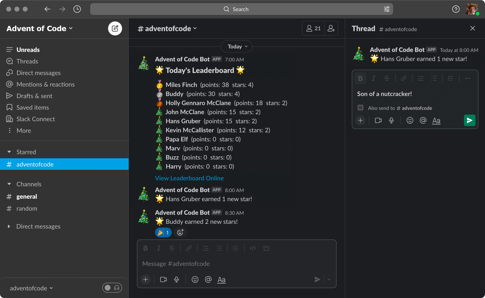

Advent-of-Code Bot
==================

A Slack bot for [Advent of Code](https://adventofcode.com). Adapted from [Tom Swartz's AdventOfCodeLeaderboard](https://github.com/tomswartz07/AdventOfCodeLeaderboard), this bot will post to Slack when members of a private leaderboard have earned new stars. It will also post the leaderboard if wanted, sorting by score, breaking ties by stars.



Usage
-----

Regardless of how you run you'll need to gather a few items first.

1. __Leaderboard ID:__ This can be found in the url when viewing your leaderboard.

    ```text
    https://adventofcode.com/YYYY/leaderboard/private/view/[LEADERBOARD ID]
    ```

2. __Session Cookie:__ While logged in to [Advent of Code](https://adventofcode.com):

    _In Firefox:_
    - Open the Developer Tools by pressing `F12`
    - Click on the small gear on the top right of the Developer Options pane
    - Scroll down and make sure that "Storage" is checked under the Default Firefox Developer Options section
    - Click on the Storage tab
    - Open the Cookies section and copy the "Value" for "session"

    _In Chrome:_
    - Open the Developer Tools by pressing `CTRL` + `Shift` + `I` or `Cmd` + `Opt` + `I` on Mac
    - Select "Application" from the tool tabs
    - Click the dropdown arrow beside cookies to expand it
    - Select *https://adventofcode.com*
    - Copy the "Value" for "session"

    __These session cookies last for about a month, so grab it close to December 1st.__

3. __Slack Webhook:__ Follow the instructions [HERE](https://slack.com/help/articles/115005265063-Incoming-webhooks-for-Slack) to create a new webhook for a channel of your choice.

Once you have gathered these items update the `env` file accordingly.

### Running Locally

```bash
pip3 install -r requirements.txt
export $(grep -v '^#' env | xargs)
./advent-of-code-bot.py                     # just grab the data
./advent-of-code-bot.py stars               # post any newly earned stars to Slack
./advent-of-code-bot.py leaderboard         # post the leaderboard to Slack
./advent-of-code-bot.py leaderboard stars   # post new stars and the leaderboard to Slack
```

### Running in Docker

1. Update the crontab to your desired schedule. Defaults to checking for new stars every 30 minutes and posts the leaderboard at 7am. The crontab will also constrain runs to December 1st through 25th, update if needed.

2. Build the container.

    ```bash
    docker build -t advent-of-code-bot:$(cat VERSION.md) .
    ```

3. Run the container.

    ```bash
    docker run --name advent-of-code-bot --env-file env -d advent-of-code-bot:$(cat VERSION.md)
    ```

4. Stop the container.

    ```bash
    docker stop advent-of-code-bot
    ```
